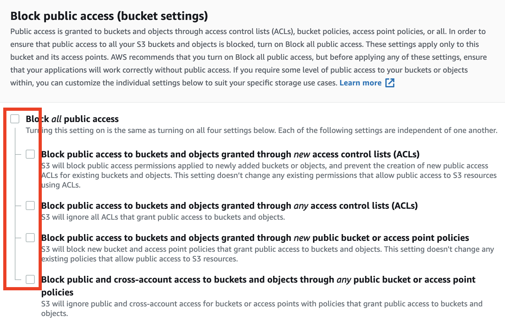

## Project Finale CO2
1. Ensure your AWS bucket containing the relevant project data exists (if it doesn't or if you have no idea what this is, please see [Fresh Start](#fresh-start))
2. [Make your existing bucket public](#make-your-bucket-public)
3. Set up a [Databricks Account](https://github.com/data-derp/documentation/blob/master/databricks/README.md) if you don't already have one
4. [Create a cluster](https://github.com/data-derp/documentation/blob/master/databricks/setup-cluster.md) if you don't already have one

5. In your User's workspace, click import

   

6. Import the `Project-Finale-CO2.py` notebook: `https://raw.githubusercontent.com/data-derp/small-exercises/master/project-finale-co2/Project-Finale-CO2.py`

   

7. Select your cluster

   

8. Follow instructions

## Fresh Start
If you don't have the artifacts in an S3 bucket yet:
1. [Ensure you have an active AWS CLI Session in your Terminal](https://docs.aws.amazon.com/cli/latest/userguide/cli-chap-configure.html))
2. [Create an S3 bucket through Cloudformation](https://github.com/data-derp/s3-bucket-aws-cloudformation)
3. Upload the transformed data:
```bash
# Change these variables
PROJECT_NAME=awesome-project
MODULE_NAME=awesome-module

./go upload-data "${PROJECT_NAME}-${MODULE_NAME}"
```

## Make Your Bucket Public
In most scenarios, your bucket containing data should NOT be public (open to the entire internet) unless your use case deems it appropriate.

1. In the **AWS Console**, navigate to your bucket and click the **Permissions** tab.
2. Click **Edit** under **Block Public Access**
   
3. Uncheck everything
   
4. Under the **Bucket Policy**, click **Edit** and paste the following policy (don't forget to change <YOUR BUCKET NAME>):
```json
{
    "Version": "2012-10-17",
    "Statement": [
        {
            "Sid": "AllowPublicRead",
            "Principal": "*",
            "Effect": "Allow",
            "Action": ["s3:GetObject"],
            "Resource": ["arn:aws:s3:::<YOUR BUCKET NAME>/*"]
        }
   ]
}
```
5. Under the **Access Control List (ACL)**:

   

   

   
    
